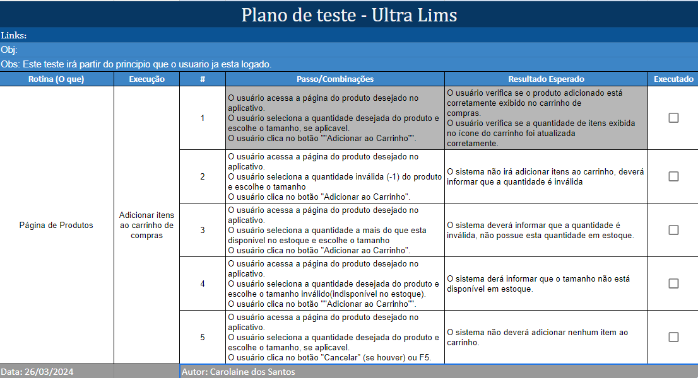
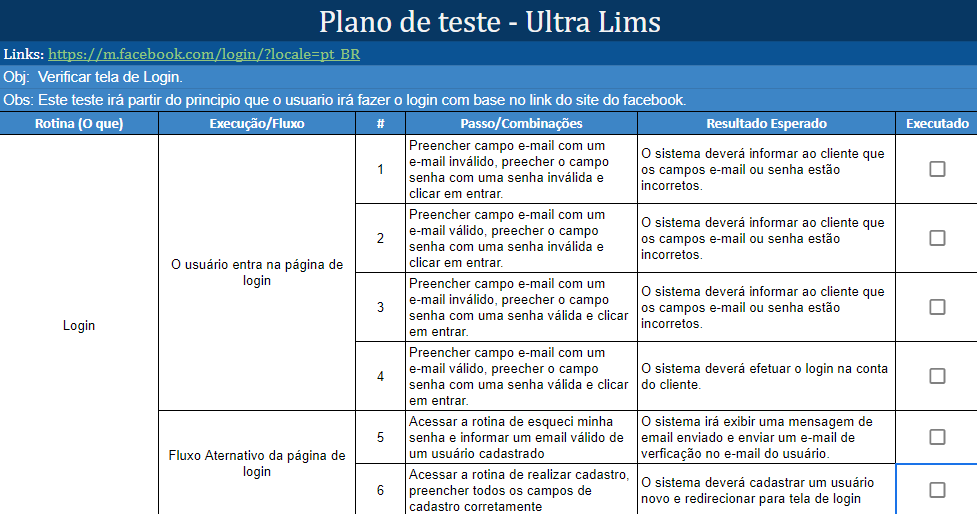

# Segunda Avaliação

## Cenário de Teste:

O cenário de teste a seguir foi definido para testar a funcionalidade de adicionar itens ao carrinho de compras em um aplicativo de comércio eletrônico:

### Descrição:

Este cenário de teste tem como objetivo garantir que os usuários possam adicionar itens ao carrinho de compras de forma eficaz e precisa no aplicativo de comércio eletrônico.

### Passos do Teste:

Acesso ao Produto Desejado:
O usuário acessa a página do produto desejado no aplicativo.

Seleção de Quantidade e Tamanho:
O usuário seleciona a quantidade desejada do produto e escolhe o tamanho, se aplicável.

Adição ao Carrinho:
O usuário clica no botão "Adicionar ao Carrinho".

Verificação no Carrinho:
O usuário verifica se o produto adicionado está corretamente exibido no carrinho de compras.

Quantidade Atualizada no Ícone do Carrinho:
O usuário verifica se a quantidade de itens exibida no ícone do carrinho foi atualizada corretamente.

## Perguntas:

Analise a abrangência do cenário de teste em relação ao objetivo geral de garantir a funcionalidade de adicionar itens ao carrinho de compras. Quais aspectos do processo de adicionar itens ao carrinho estão sendo testados? Existem etapas ou cenários adicionais que poderiam ser incluídos para uma cobertura mais completa?

- **Foram testados apenas funcionalidades básicas como, o acesso ao a página do produto, seleção de quantidade e tamanho, adicionar o produto no carrinho, verificação a respeito do produto e por fim verifica a se a quantidade esta correta após adicionar o produto.**

- **Sobre os cenários adicionais, poderia incluir cenários em que o produto adicionado não está disponível no estoque. Neste caso é interessante que mostre uma mensagem dizendo que o produto não está disponível no estoque ou esgotado, ajudando assim para que o usuario tenha a melhor experiência e com um feedback apropriado, além de garantir a confiabilidade no processo da compra.**

Avalie a clareza e a precisão dos passos do teste. Os passos fornecidos são facilmente compreensíveis e executáveis? Eles abordam todas as ações necessárias para adicionar um item ao carrinho de compras de forma eficaz?

- **Os passos aplicados não estão bem detalhados, poderia existir mais informações a respeito do teste, com regra de negócio ou o próprio aplicativo em si para a conferencia dos possiveis passos a serem realizados**,

Identifique possíveis falhas ou lacunas no cenário de teste. Existem áreas onde o cenário pode não detectar problemas relevantes que os usuários podem enfrentar ao adicionar itens ao carrinho de compras?

- **Foi testado apenas um único caso de teste, sendo ele o caminho feliz, e este cenário não detalhou os passos de como chegar até determinada função nem quais valores inserir que deverão gerar o resultado esperado ao final do teste, ou então sem considerar possíveis comportamentos inesperados da parte do usuário**,

Sugira melhorias para aumentar a eficácia e a abrangência do teste. Isso pode incluir a adição de etapas adicionais, a consideração de cenários de teste alternativos ou a implementação de técnicas de teste específicas.
Com base em sua análise do cenário de teste, forneça uma estimativa de sua confiança na capacidade do teste em garantir a funcionalidade de adicionar itens ao carrinho de compras. Quais são os pontos fortes e as áreas de melhoria percebidos no cenário de teste?

- **Os casos de testes de 2 a 4 são para validar valores incorretos. O caso de teste 5 é para verificar um comportamento inesperado, como cancelamento ou atualização. Percebi também que o cenário deixa implicito que o usuário já está logado, aproveitei para criar um caso de teste para o login.**

Segue o link da [planilha.](https://docs.google.com/spreadsheets/d/1aMNtg3jd-b5D9xesbaDQ7PLenlBQtWmJriN45NWGPaY/edit?usp=sharing)

Caso solicitado:

Caso de login:

